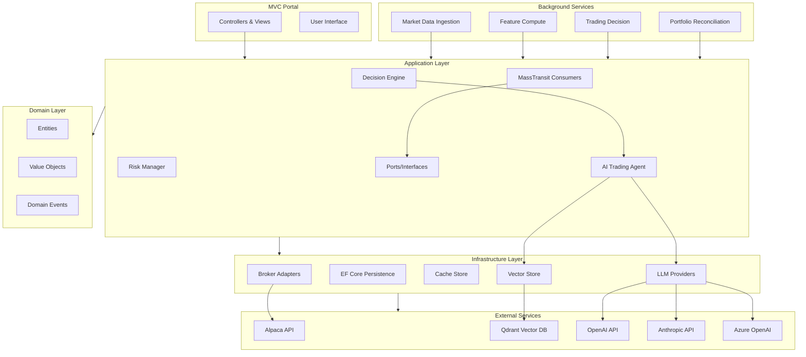
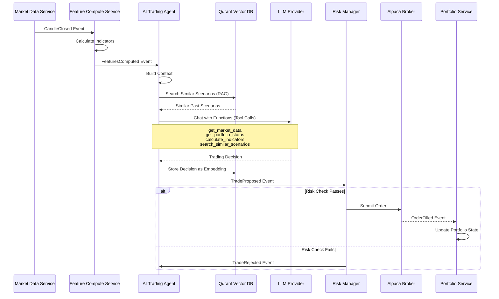

# Bipins.AI.Trading Platform

An **AI Agentic Trading Bot** platform that demonstrates autonomous decision-making, tool use, reasoning loops, and RAG patterns for algorithmic trading. Built with .NET 8, featuring event-driven architecture, multi-LLM provider support, and comprehensive risk management.

## Business Overview

### Target Market

The Bipins.AI.Trading platform serves multiple market segments:

- **Trading Firms & Hedge Funds**: Institutional traders seeking AI-powered algorithmic trading solutions with autonomous decision-making capabilities
- **Individual Traders & Investors**: Retail traders looking for intelligent trading automation with paper trading capabilities
- **Fintech Demonstration Platform**: Educational and demonstration platform showcasing AI agentic patterns, RAG integration, and event-driven architecture

### Business Value Proposition

- **Autonomous AI-Driven Trading**: LLM-powered agents make independent trading decisions using multi-step reasoning, eliminating the need for manual rule-based strategies
- **Risk Management**: Built-in guardrails and risk checks ensure safe trading operations with configurable limits
- **Portfolio Optimization**: Real-time portfolio tracking, position management, and performance analytics
- **Learning & Adaptation**: RAG-based memory system allows the agent to learn from past trading scenarios and improve decision quality over time
- **Multi-Provider Flexibility**: Support for multiple LLM providers (OpenAI, Anthropic, Azure OpenAI) ensures vendor independence and cost optimization

### Use Cases

- **Algorithmic Trading**: Automated trading execution for retail and institutional traders with AI-driven decision making
- **AI Agent Demonstration**: Showcase of agentic AI patterns including function calling, tool use, and RAG integration
- **Paper Trading**: Risk-free trading simulation with real-time market data from Alpaca
- **Strategy Backtesting**: Test and optimize trading strategies using historical data and AI analysis
- **Educational Platform**: Learning resource for understanding AI agentic systems, event-driven architecture, and trading automation

### Competitive Advantages

- **Multi-LLM Provider Support**: Seamless switching between OpenAI, Anthropic, and Azure OpenAI without code changes
- **RAG-Based Learning**: Vector memory system enables the agent to learn from past trading scenarios and improve decision quality
- **Event-Driven Architecture**: Scalable, decoupled system design using MassTransit (ready for RabbitMQ/Azure Service Bus)
- **Clean Architecture**: Extensible design allows easy addition of new brokers, strategies, and features
- **Hybrid Decision Making**: Combines AI agentic reasoning with deterministic fallback strategies for reliability

## Key Features

- **🤖 AI Agentic Bot**: Autonomous LLM-powered trading agent with function calling, multi-step reasoning, and RAG patterns
- **🛠️ Tool Use**: Agent can gather market data, calculate indicators, check portfolio, and search similar scenarios
- **🧠 RAG Integration**: Vector memory (Qdrant) for storing and retrieving similar past trading scenarios
- **🔄 Multi-Provider LLM Support**: OpenAI, Anthropic, and Azure OpenAI with configurable providers
- **Event-Driven Architecture**: MassTransit with in-memory transport (swappable to RabbitMQ/Azure Service Bus)
- **Broker Abstraction**: Alpaca support with extensible design for other brokers
- **Trading Modes**: Ask (manual approval) or Auto (automatic execution)
- **Risk Management**: Built-in guardrails and risk checks
- **Decision Engines**: AI Agent (primary) and deterministic RSI/MACD strategy (fallback)
- **Web Portal**: Complete MVC interface for monitoring, control, and agent interaction
- **Vector Storage**: Qdrant integration for agent memory and scenario retrieval
- **In-Memory Storage**: SQLite file-based for development (ready for SQL Server)

## Architecture

### System Architecture

### Trading Decision Sequence

## Documentation

- [Overview](docs/00-overview.md) - System purpose and key features
- [Quick Start](docs/01-quickstart.md) - Setup and first run
- [Configuration](docs/02-configuration.md) - All configuration options
- [Architecture](docs/03-architecture.md) - System design and data flow
- [Operations](docs/04-operations.md) - Trading modes, monitoring, troubleshooting
- [AI Agent](docs/07-ai-agent.md) - AI agentic bot architecture, usage, and patterns
- [Extending Brokers](docs/05-extending-brokers.md) - How to add new broker adapters
- [Extending Strategies](docs/06-extending-strategies.md) - How to add new decision engines

## Safety Features

- **Trading disabled by default** - Must explicitly enable in configuration
- **Hard risk guardrails** - Always enforced regardless of mode
- **Idempotent operations** - Safe to retry
- **Comprehensive logging** - Full audit trail

## Enterprise-Grade TODO

### Security & Authentication
- [ ] Implement OAuth2/OIDC authentication with multiple identity providers (Azure AD, Google, Okta)
- [ ] Add role-based access control (RBAC) with fine-grained permissions
- [ ] Encrypt API keys and sensitive configuration data at rest using Azure Key Vault or AWS Secrets Manager
- [ ] Implement API key rotation policies and automated key management
- [ ] Add comprehensive audit logging for all trading operations and configuration changes
- [ ] Implement IP whitelisting and rate limiting for API endpoints
- [ ] Add two-factor authentication (2FA) for user accounts
- [ ] Implement session management with configurable timeout and concurrent session limits

### Observability & Monitoring
- [ ] Integrate OpenTelemetry for distributed tracing across all services
- [ ] Add Prometheus metrics collection with custom business metrics (trade success rate, PnL, latency)
- [ ] Implement Grafana dashboards for real-time monitoring and alerting
- [ ] Add structured logging with correlation IDs for request tracing
- [ ] Implement health check endpoints with dependency status (database, message queue, external APIs)
- [ ] Add alerting rules for critical events (risk breaches, API failures, system errors)
- [ ] Create performance monitoring dashboards (response times, throughput, error rates)

### Scalability & Performance
- [ ] Migrate from in-memory MassTransit to RabbitMQ or Azure Service Bus for horizontal scaling
- [ ] Implement database connection pooling and query optimization for SQL Server migration
- [ ] Add Redis caching layer for frequently accessed data (market data, portfolio state)
- [ ] Implement horizontal scaling with load balancing for web services
- [ ] Add message queue partitioning and consumer scaling strategies
- [ ] Optimize vector database queries with indexing and collection sharding
- [ ] Implement async/await patterns throughout for better concurrency
- [ ] Add response caching for static and semi-static data

### Reliability & Resilience
- [ ] Implement circuit breaker pattern for external API calls (Alpaca, LLM providers)
- [ ] Add retry policies with exponential backoff for transient failures
- [ ] Implement dead letter queues for failed messages
- [ ] Add database transaction management with proper rollback handling
- [ ] Implement graceful shutdown for background services
- [ ] Add data validation and sanitization at API boundaries
- [ ] Create disaster recovery plan with automated backup and restore procedures
- [ ] Implement idempotency keys for all critical operations

### Testing & Quality Assurance
- [ ] Add comprehensive integration tests for all message consumers
- [ ] Implement end-to-end (E2E) tests for complete trading workflows
- [ ] Add load testing with k6 or Locust to identify performance bottlenecks
- [ ] Implement chaos engineering tests (network failures, service outages)
- [ ] Add contract testing for message contracts between services
- [ ] Create test data factories and builders for consistent test scenarios
- [ ] Implement mutation testing to improve test coverage quality
- [ ] Add performance benchmarking tests for critical paths

### DevOps & Infrastructure
- [ ] Create CI/CD pipelines with GitHub Actions or Azure DevOps
- [ ] Containerize application with Docker and create docker-compose for local development
- [ ] Implement infrastructure as code (IaC) with Terraform or Bicep
- [ ] Add automated deployment strategies (blue-green, canary) for zero-downtime deployments
- [ ] Create Kubernetes manifests for container orchestration
- [ ] Implement automated database migrations with rollback capabilities
- [ ] Add environment-specific configuration management (dev, staging, production)
- [ ] Create monitoring and alerting infrastructure as code

### Compliance & Governance
- [ ] Implement data retention policies with automated archival
- [ ] Add regulatory compliance features (SEC, FINRA requirements for trading systems)
- [ ] Create comprehensive audit trails for all trading decisions and executions
- [ ] Implement data privacy controls (GDPR, CCPA compliance)
- [ ] Add data encryption in transit (TLS) and at rest
- [ ] Create compliance reporting dashboards and exports
- [ ] Implement user activity logging and access reviews
- [ ] Add data lineage tracking for trading decisions

### Advanced Features
- [ ] Implement real-time market data streaming with WebSocket support
- [ ] Add mobile API endpoints for iOS/Android applications
- [ ] Create RESTful API with OpenAPI/Swagger documentation
- [ ] Implement GraphQL API for flexible data querying
- [ ] Add support for options and futures trading
- [ ] Implement backtesting engine with historical data replay
- [ ] Add strategy performance analytics and reporting
- [ ] Create webhook support for external integrations
- [ ] Implement feature flags for gradual feature rollouts
- [ ] Add A/B testing framework for strategy optimization

### Multi-Tenancy & Resource Management
- [ ] Implement multi-tenant architecture with tenant isolation
- [ ] Add resource quotas and rate limiting per tenant
- [ ] Create billing and usage tracking system
- [ ] Implement tenant-specific configuration and feature flags
- [ ] Add tenant data isolation at database and cache levels
- [ ] Create tenant management UI and APIs
- [ ] Implement cross-tenant analytics and reporting

## License

[Your License Here]
