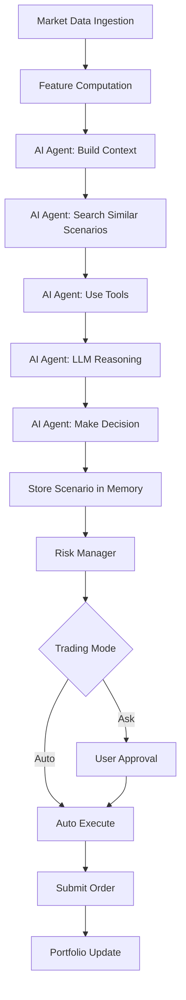

# AI Agentic Trading Bot

## Overview

The AI Agent is the core component that demonstrates autonomous decision-making using Large Language Models (LLMs). It showcases key agentic patterns including tool use, multi-step reasoning, and RAG (Retrieval-Augmented Generation).

## Architecture

### Components

1. **TradingAgent**: Main orchestrator that builds context and makes decisions
2. **AgentMemory**: Manages storing and retrieving trading scenarios in Qdrant
3. **AgentTools**: Function definitions for LLM function calling
4. **AIAgentDecisionEngine**: Implements `IDecisionEngine` interface using the AI agent
5. **LLM Providers**: Abstracted LLM integration (OpenAI, Anthropic, Azure OpenAI)

### Decision Flow



## Agent Capabilities

### Tool Use

The agent has access to the following tools via function calling:

1. **get_market_data**: Retrieve historical candles and current price
2. **get_portfolio_status**: Get current positions, cash, equity, PnL
3. **calculate_indicators**: Compute technical indicators (RSI, MACD, Stochastic)
4. **search_similar_scenarios**: Find similar past trading scenarios from vector memory
5. **get_trading_history**: Get past decisions and their outcomes

### RAG Pattern

The agent uses RAG (Retrieval-Augmented Generation) to improve decisions:

1. **Storage**: Each trading decision is stored as an embedding in Qdrant
   - Embedding includes: market conditions, indicators, decision, rationale
   - Payload includes: symbol, timestamp, outcome PnL, success flag

2. **Retrieval**: When making new decisions, the agent:
   - Generates embedding from current market conditions
   - Searches Qdrant for similar past scenarios
   - Includes top-K similar scenarios in LLM context

3. **Learning**: The agent learns from past successes and failures:
   - Successful decisions reinforce patterns
   - Failed decisions help avoid similar mistakes

### Multi-Step Reasoning

The agent performs autonomous reasoning:

1. **Context Gathering**: Uses tools to collect all necessary information
2. **Analysis**: LLM analyzes market conditions, indicators, portfolio status
3. **Planning**: LLM creates a trading plan based on analysis
4. **Decision**: LLM makes final decision with confidence and rationale
5. **Reflection**: Stores decision for future learning

## Configuration

### LLM Provider Setup

Configure your LLM provider in `appsettings.json`:

```json
{
  "LLM": {
    "Provider": "OpenAI",
    "OpenAI": {
      "ApiKey": "your-api-key",
      "Model": "gpt-4",
      "Temperature": 0.7,
      "MaxTokens": 2000,
      "EmbeddingModel": "text-embedding-3-small"
    }
  }
}
```

Supported providers:
- **OpenAI**: GPT-4, GPT-3.5, with embeddings
- **Anthropic**: Claude models
- **Azure OpenAI**: Azure-hosted OpenAI models

### Vector Database Setup

Ensure Qdrant is running:

```bash
cd docker
docker-compose up -d
```

The agent will automatically create the `trading_scenarios` collection when first storing a scenario.

## Usage

### Via Web Portal

1. Navigate to **AI Agent** in the portal menu
2. View agent status and configuration
3. Use **Test Decision** to test the agent on a specific symbol/timeframe
4. View **Memory** to see vector database status

### Programmatic Usage

The AI agent is automatically used when:
- LLM provider is configured in `appsettings.json`
- `TradingDecisionHostedService` calls `IDecisionEngine.MakeDecisionAsync`

The system automatically falls back to deterministic `DecisionEngine` if LLM is not configured.

## Agent Decision Format

The agent returns decisions in the following format:

```json
{
  "action": "Buy|Sell|Hold",
  "confidence": 0.0-1.0,
  "rationale": "Explanation of decision",
  "quantityPercent": 0-100,
  "suggestedStopLoss": 100.50,
  "suggestedTakeProfit": 105.00
}
```

## Demonstration Patterns

### 1. Autonomous Decision-Making

The agent independently:
- Analyzes market conditions
- Uses tools to gather information
- Makes trading decisions without human intervention

### 2. Tool Use Pattern

Demonstrates function calling:
- LLM requests tool execution
- Tools return structured data
- LLM uses tool results in reasoning

### 3. RAG Pattern

Shows retrieval-augmented generation:
- Stores scenarios as embeddings
- Retrieves similar scenarios
- Uses retrieved context in decision-making

### 4. Multi-Step Reasoning

Exhibits complex reasoning:
- Plans before executing
- Uses multiple tools in sequence
- Synthesizes information from multiple sources

### 5. Learning Pattern

Demonstrates continuous improvement:
- Stores decisions and outcomes
- Retrieves similar past scenarios
- Learns from successes and failures

## Observability

### Logging

The agent logs:
- Context building steps
- Tool executions
- LLM requests and responses
- Decision outcomes
- Memory operations

### UI Monitoring

The web portal provides:
- Agent status and configuration
- Test decision interface
- Memory browser
- Decision history

## Best Practices

1. **Start with Paper Trading**: Always test in paper trading mode first
2. **Monitor Decisions**: Review agent decisions regularly
3. **Tune Temperature**: Lower temperature (0.3-0.5) for more deterministic decisions
4. **Review Memory**: Check stored scenarios to understand agent learning
5. **Set Risk Limits**: Always use risk management guardrails
6. **Use Ask Mode**: Start with Ask mode to review decisions before execution

## Troubleshooting

### Agent Not Making Decisions

- Check LLM API key is configured
- Verify Qdrant is running
- Check logs for LLM API errors
- Ensure sufficient market data is available

### Poor Decision Quality

- Review similar scenarios in memory
- Adjust LLM temperature
- Check indicator calculations
- Review agent rationale in logs

### Memory Issues

- Verify Qdrant is accessible
- Check collection exists
- Review embedding generation logs
- Ensure sufficient memory for Qdrant

## Extending the Agent

### Adding New Tools

1. Define tool in `AgentTools.GetTradingTools()`
2. Implement tool execution in `TradingAgent.ExecuteToolAsync()`
3. Update system prompt if needed

### Customizing Reasoning

1. Modify `BuildSystemPrompt()` in `TradingAgent`
2. Adjust `BuildUserPrompt()` for context formatting
3. Update decision parsing in `ParseDecisionFromResponse()`

### Enhancing Memory

1. Modify `CreateEmbeddingText()` in `AgentMemory`
2. Adjust similarity search parameters
3. Add additional metadata to stored scenarios

## Future Enhancements

- Multi-agent collaboration
- Reinforcement learning from outcomes
- Advanced prompt engineering
- Custom embedding models
- Real-time streaming decisions
- Agent explainability dashboard
